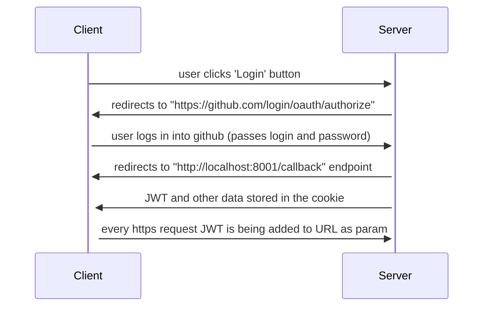

# REACT-VUE-SVELTE comparison

This project aims to compare 3 javascript frameworks in which a simple Todo App was coded.

```mermaid
sequenceDiagram
    Client->>+Server: user clicks 'Login' button 
    Server->>+Client: redirects to "https://github.com/login/oauth/authorize"
    Client->>+Server: user logs in into github (passes login and password)
    Server->>+Client: redirects to "http://localhost:8001/callback" endpoint
    Server->>+Client: JWT and other data stored in the cookie
    Client->>+Server: every https request JWT is being added to URL as param
```