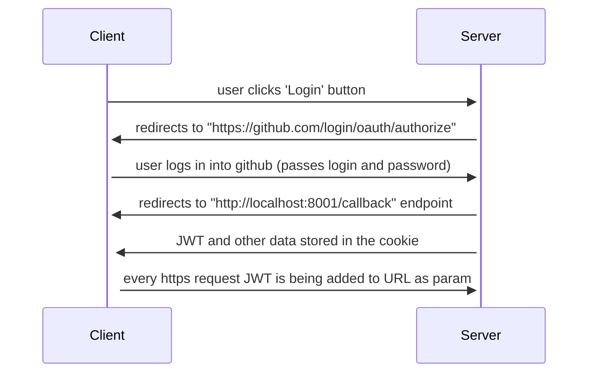

# Todo app in 3 js frameworks

This project aims to compare 3 javascript frameworks in which a simple Todo App was coded.
Compared frameworks are React, Vue and Svelte.

# React

React was developed by Facebook in March 2013 and it is an open-source framework.
Link to the repo: https://github.com/facebook/react

### Pros
+ well written documentation
+ component-based: reusable code
+ large community

### Cons
- jsx required
- big package size

# Vue

Vue was developed by Evan You in February 2014 and it is an open-source framework.
Link to the repo: https://github.com/vuejs/vue

### Pros
 + good documentation
 + component-based: reusable code
 + fast

### Cons
- smaller community then in React

# Svelte

Svelte was developed by Rich Harris in November 2016 and it is an open-source framework.
Link to the repo: https://github.com/sveltejs/svelte

### Pros
 + easy to learn
 + fast
 + small package size

### Cons
- small community
- fewer third party libraries and tools

Below you can find a table which as a summary compares 9 important features of each frameworks.

| `Feature`       | Svelte             | React              | Vue                | 
| -------------   | -------------------| -------------------|------------------- |
| `community`     | medium             | the biggest        | big                | 
| `documentation` | full documentation | full documentation | full documentation |
| `debugger`      | possible           | possible           | possible           | 
| `bugs`          | lack               | lack               | lack               |
| `structure`     | clear              | clear              | clear              | 
| `css`           | easy to add        | easy to add        | easy to add        |
| `extensions`    | few                | a lot              | a lot              | 
| `libraries`     | few                | a lot              | a lot              |
| `testing`       | possible           | possible           | possible           | 

# Authentication & authorization

Authentication and authorization were added to React and Svelte app. Both are sharing common backend authentication.py file.

